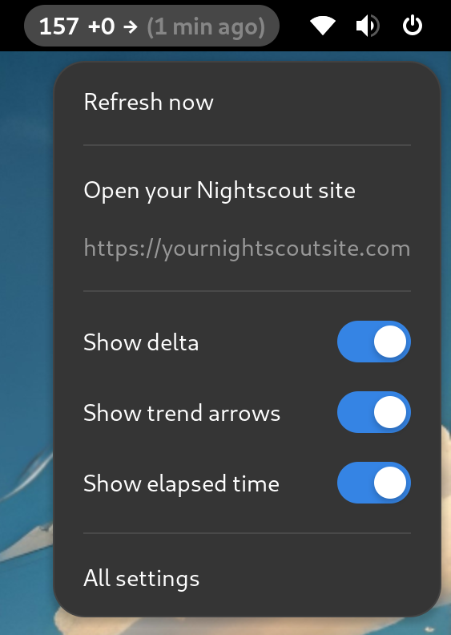

# Nightscout indicator

<a href="https://extensions.gnome.org/extension/7388/nightscout/" target="_blank"></a>

A GNOME extension to keep an eye on your glucoses levels stored in a Nightscout site.




## Features

### Visible bits of information:
- Glucose level.
- Trending arrow (optional).
- Delta or variation between readings (optional).
- Elapsed time since the reading was taken (optional).
- Define update timing and when to mark data as stale.

### Notifications
- When you go out of range and too low or too high.
- When data is marked as stale.
- When the level rises or drops too fast.


## Install from source and development

Download the `nightscout@jeroen.wtf` directory and move it to `~/.local/share/gnome-shell/extensions/`. Enable the extension in **Extensions** or **Extension Manager**, or using the following command:

```bash
$ gnome-extensions enable nightscout@jeroen.wtf
```

#### Roadmap

I developed it to cover my needs, which so far doesn't include insulin pump features, for example. Will look into it, but let me know if you need anything and will do my best to add support for them. So far, I have this list of things in mind:

- [ ] Include optional graph?
- [ ] Add button to preview notifications in prefs?
- [ ] Allow to set if the extension is for the user or for monitoring someone else and adjust copies.
- [x] Add colors based on range and setting to toggle them.
- [x] Add button to check connection to Nightscout server.
- [ ] Check if we have internet or wait for it when starting.
- [ ] Remove notifications that are no longer valid.


## FAQ

#### What are the different notification urgency levels?

According to [the documentation](https://gjs.guide/extensions/topics/notifications.html), the urgency level controls how and when the notifications are presented to the user. Copypasting from the documentation:

> ##### Low
> These notifications will be shown in the tray, but will not popup on the screen or be expanded.
>
> #### Normal
> These notifications will be shown in the tray, and will popup on the screen unless the policy forbids it.
>
> #### High
> These notifications will be shown in the tray, and will popup on the screen unless the policy forbids it.
>
> #### Critical
> These notifications will always be shown, with the banner expanded, and must be acknowledged by the user before they will be dismissed.

I would suggest you to try them and see what works better for you. In the future I want to add better management for the notifications, like snoozing them and so on.


## Troubleshooting

As of today I just created the extension. For sure there are bugs and improvements that I will do over time. If you have questions or problems feel free to open an issue and will take a look as soon as I can. Thank you for your patience!


## Acknowledgements

- The people behind the [Nightscout](https://nightscout.github.io/) project, because of their work and effort to make our lives easier.
- [Fernando Pradas](https://github.com/fnandot) for [his GNOME extension](https://github.com/fnandot/gnome-shell-extension-nightscout) that served as inspiration and some code snippets.
- The [Clipboard indicator](https://github.com/Tudmotu/gnome-shell-extension-clipboard-indicator/) and [tailwind-status](https://github.com/maxgallup/tailscale-status) extensions for additional learning.


